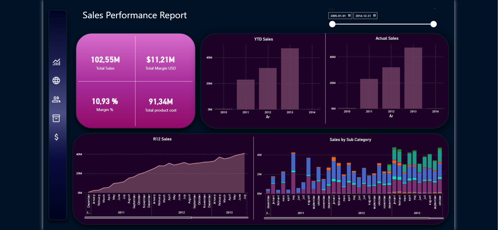
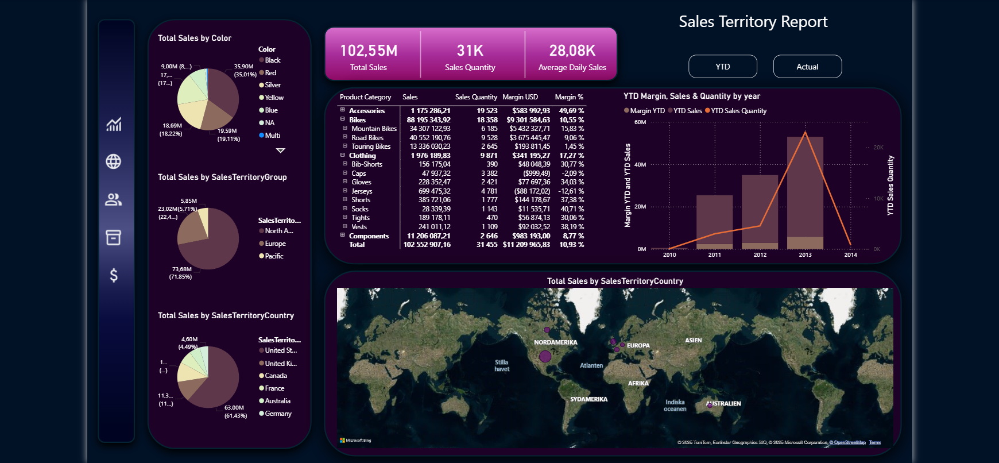
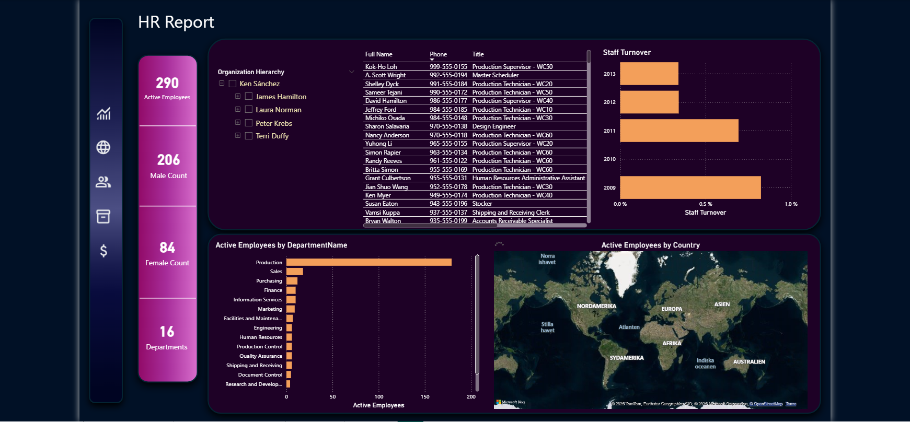
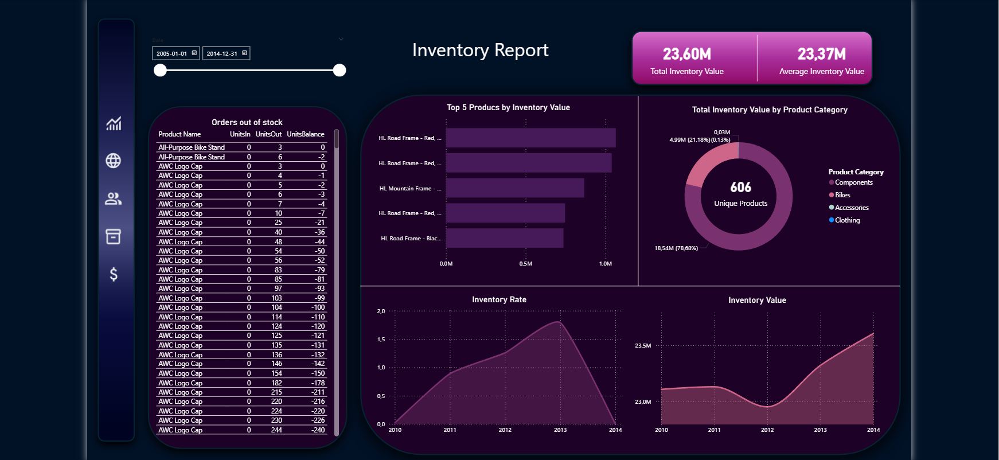
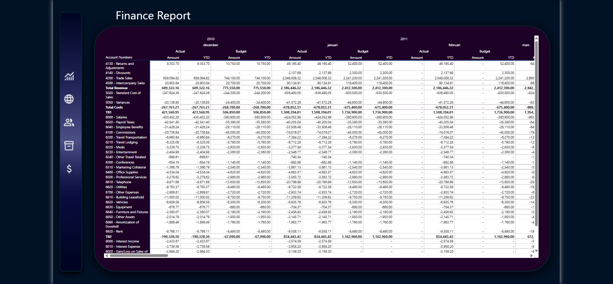

# Freddys-bicycles-powerbi
Power BI project for Freddy’s Bicycles with advanced sales, HR, inventory, and financial analysis based on SQL-extracted data and star schema modeling.

# Freddy's Bicycles – Power BI Project

## 📌 Overview

This Power BI project was developed for a fictional company, Freddy’s Bicycles, to deliver dynamic, interactive reports for Sales, HR, Inventory, and Financial performance.

> 🏫 **Note:** This assignment was completed in 2024 as part of coursework in the "System Understanding (Power BI)" module at Nackademin Vocational School. The project involved data extraction via SQL, transformation in Power Query, star schema modeling, and advanced DAX calculations.

---

## 🛠️ Project Workflow

### 🔍 Data Extraction
- Connected to a remote SQL database using DirectQuery and SQL scripts.
- Exported selected tables to CSV format for external processing.

### 🔧 Data Transformation
- Cleaned and reshaped raw datasets using Power Query Editor.
- Standardized date formats, handled null values, removed duplicates, and split columns as needed.

### 🧱 Data Modeling
- Implemented a star schema with fact and dimension tables.
- Built relationships to support accurate filtering and drill-downs.
- Created calculated columns and DAX measures including YTD, R12, margins, average values, and budget variance.

---

## 📑 Reports & Features

### 1. 🛒 **Sales Analysis**
- KPIs for sales, costs, margins, and number of sales
- R12, YTD, and actuals over time
- Drillable by product, subcategory, and category
- Sales by territory, color, country, and continent
- Currency conversion logic

### 2. 👥 **HR Dashboard**
- Employee distribution by department and country
- List of employees with phone, job title, group, and age
- Tenure and turnover tracking
- Organizational chart

### 3. 📦 **Inventory Report**
- Total and average inventory value
- Unique product count
- Top 5 products by inventory value
- Stock-out detection and inventory turnover rate

### 4. 💰 **Finance Report**
- Income statement with budget vs. actual at account level
- Select by date and company
- TB1, TB2, TB3 profit levels
- Results in both YTD and actual

---

## 📸 Dashboard Previews

### 🔹 Sales Performance Report

### 🌍 Sales Territory Report

### 👥 HR Report

### 📦 Inventory Report

### 💰 Finance Report

---

## 🧰 Tools Used

- Power BI Desktop
- SQL Server / DirectQuery
- Power Query
- DAX (Data Analysis Expressions)
- Excel/CSV (data export)

---

## ✨ Usage

1. Clone or download the repository.
2. Open `Freddy_Bicycles_Report.pbix` using Power BI Desktop.
3. Explore the dashboards interactively using filters and slicers.

